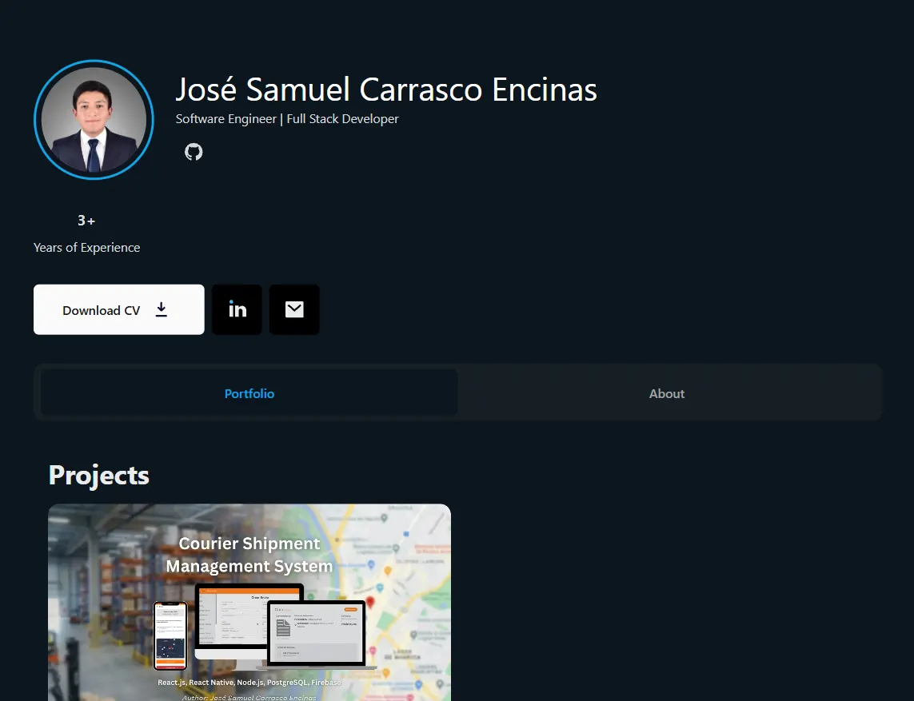

  
  <h1>Hi there 👋, I'm José Samuel Carrasco Encinas</h1>
  <h3>Software Engineer | Full Stack Developer | QA Automation Specialist</h3>
  
  

    <em>Building scalable solutions, ensuring software quality, and crafting seamless digital experiences.</em>
  

  
  
  

---

## 👨‍💻 About Me

I am a passionate **Software Engineer** based in La Paz, Bolivia, with a strong foundation in Computer Systems Engineering from *Universidad Privada Boliviana*. My career is driven by a deep enthusiasm for creating user-centric applications and ensuring their reliability through rigorous testing strategies.

Currently, I balance two dynamic roles that allow me to see the full software lifecycle:
* **Software QA Tester at Shipedge:** Where I ensure product reliability using automation tools like **Playwright** and executing comprehensive testing strategies.
* **Full Stack Developer at Prospera Servicios Financieros:** Where I build robust financial solutions using **React, Express, and Flutter**, focusing on both frontend experience and backend stability.

I thrive in collaborative environments where innovation meets execution, constantly refining my skills in modern web and mobile technologies.

---

## 🚀 Featured Project: BCPlus Courier Management System

This portfolio itself showcases my ability to deliver complex, real-world solutions. **BCPlus Courier** is a comprehensive logistics system designed to modernize and automate the operations of a courier company.

  

### 🔹 The Problem
BCPlus Courier relied on manual spreadsheets and phone calls for tracking, leading to data inconsistencies, operational delays, and a lack of transparency for clients.

### 🔹 The Solution
I engineered a centralized ecosystem comprising three interconnected platforms:
1.  **Web Admin Dashboard:** For real-time shipment management, tariff calculation, and automated reporting.
2.  **Mobile App for Messengers:** Built with **React Native**, allowing field staff to update status and upload proof of delivery instantly.
3.  **Client Tracking Portal:** A public interface for customers to track their packages autonomously.

### 🔹 Key Technologies Used
* **Frontend:** React.js, React Native, Expo, Tailwind CSS
* **Backend:** Node.js, Express.js, PostgreSQL, Firebase
* **Infrastructure:** Docker, Render, Vercel

> *This project reduced operational times by ~95% and eliminated data redundancy.*

---

## 🛠️ Technical Arsenal

My expertise spans the entire development stack, from crafting pixel-perfect UIs to designing scalable database architectures and ensuring quality through automation.

### 💻 Languages
      

### ⚛️ Frontend & Mobile
       

### ⚙️ Backend & API
    

### 🗄️ Database & Cloud
    

### 🧪 QA & Tools
    

---

## 📈 My Contribution Journey

  
    
  
    
  

---

  <i>Let's build something amazing together. Feel free to reach out!</i>

